# EduStack IS – ArchiMate diagramy

> Architektonické diagramy mapující procesy, komponenty a infrastrukturu systému EduStack IS ve stylu ArchiMate (business, application, technology layers).

---

## Obsah

1. [Přehled vrstev (Layered View)](#1-přehled-vrstev)
2. [Business Layer – aktéři a služby](#2-business-layer--aktéři-a-služby)
3. [Procesy – Autentizace](#3-proces--autentizace)
4. [Procesy – Správa školy](#4-proces--správa-školy)
5. [Procesy – Správa uživatelů](#5-proces--správa-uživatelů)
6. [Procesy – Kurikulum](#6-proces--kurikulum)
7. [Procesy – Rozvrh](#7-proces--rozvrh)
8. [Procesy – Klasifikace](#8-proces--klasifikace)
9. [Procesy – Komunikace](#9-proces--komunikace)
10. [Application Layer – komponenty](#10-application-layer--komponenty)
11. [Technology Layer – infrastruktura](#11-technology-layer--infrastruktura)
12. [Integrační pohled](#12-integrační-pohled)

---

## 1. Přehled vrstev

Celkový pohled na systém EduStack IS ve třech ArchiMate vrstvách:

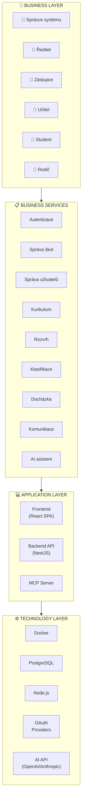

---

## 2. Business Layer – aktéři a služby

Mapování aktérů (rolí) na business služby, které využívají:

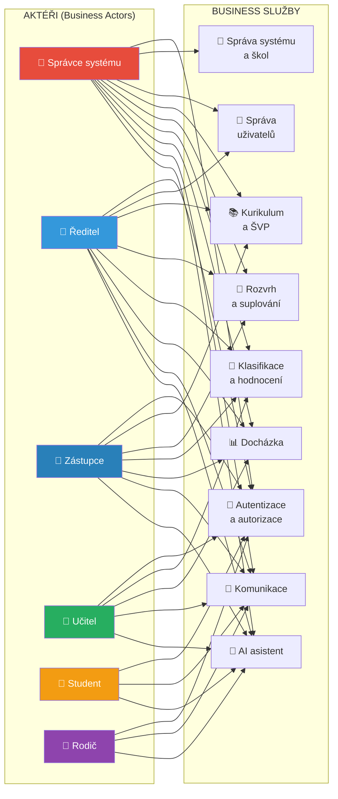

---

## 3. Proces – Autentizace

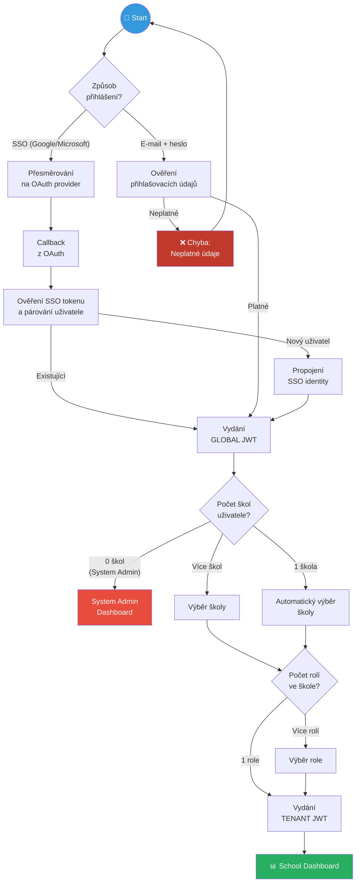

---

## 4. Proces – Správa školy

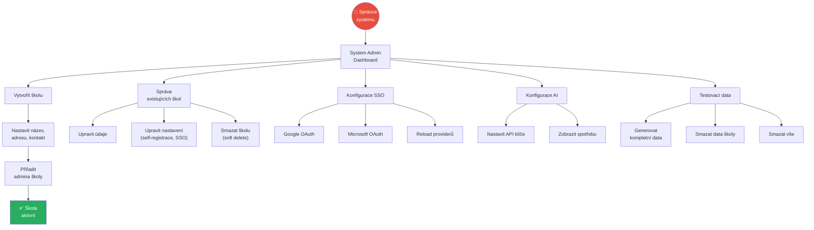

---

## 5. Proces – Správa uživatelů

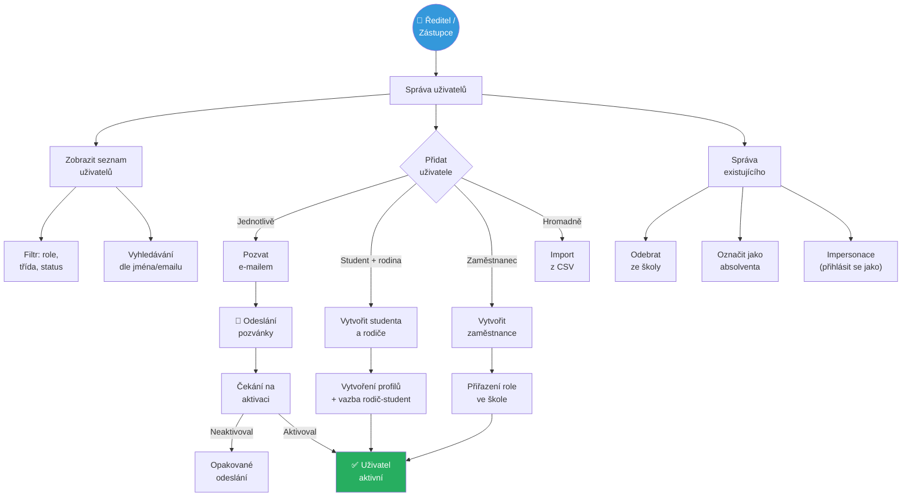

---

## 6. Proces – Kurikulum

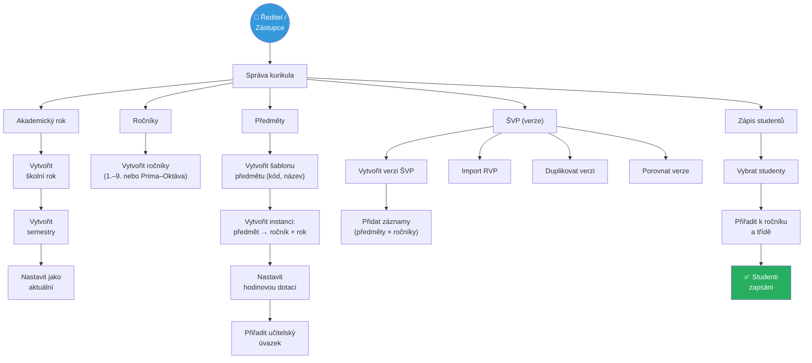

---

## 7. Proces – Rozvrh

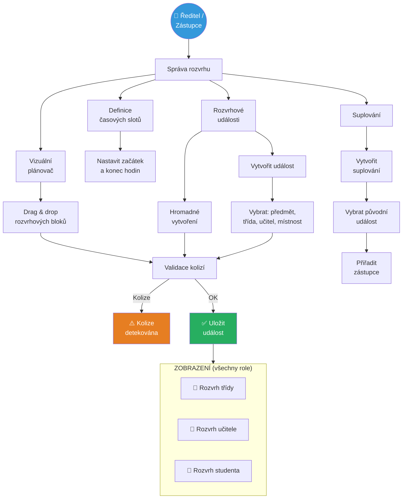

---

## 8. Proces – Klasifikace

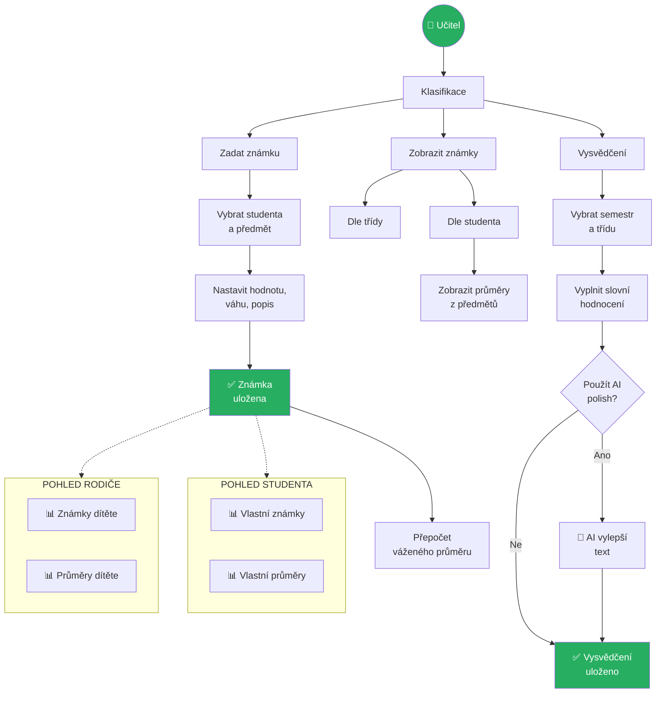

---

## 9. Proces – Komunikace

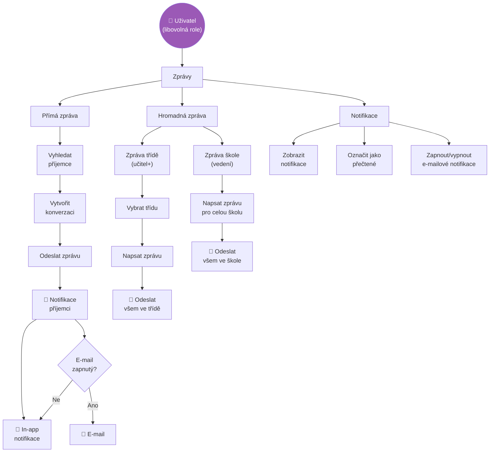

---

## 10. Application Layer – komponenty

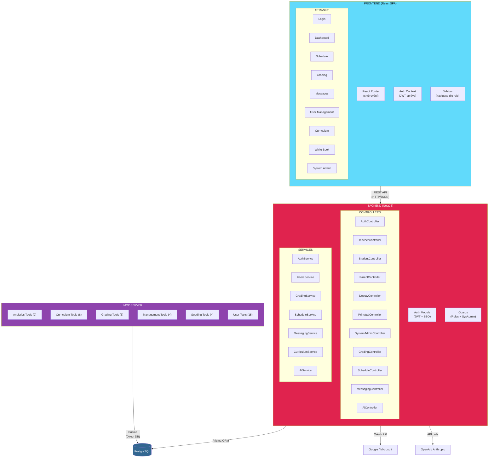

---

## 11. Technology Layer – infrastruktura

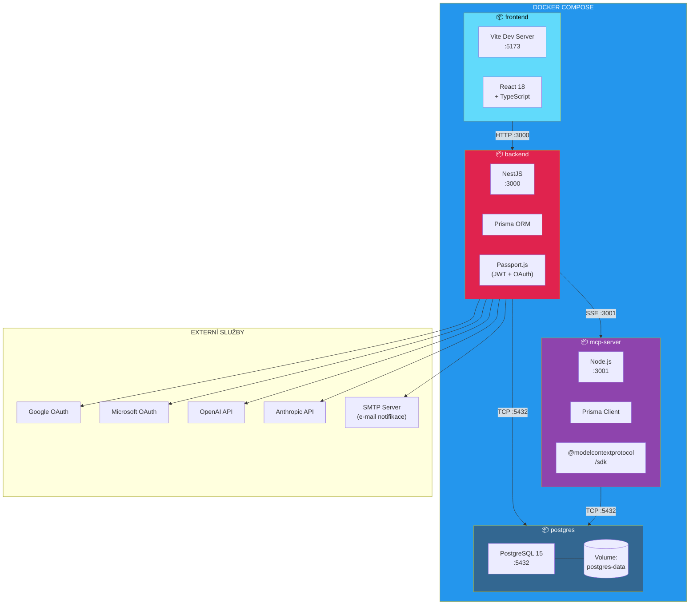

---

## 12. Integrační pohled

Celkový pohled na datové toky mezi vrstvami a komponentami:

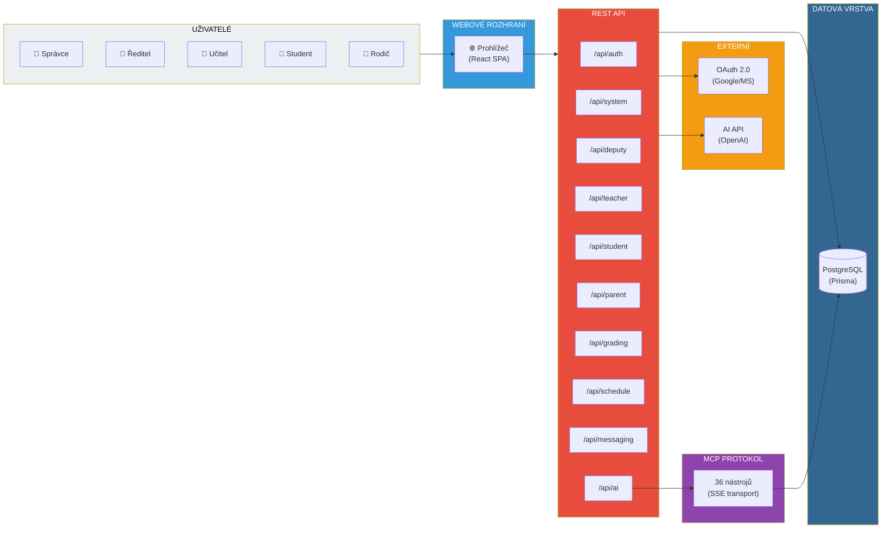
