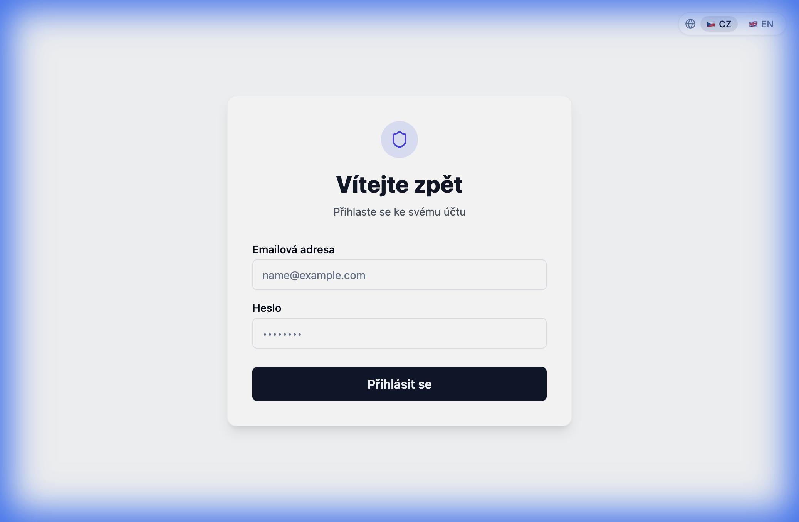
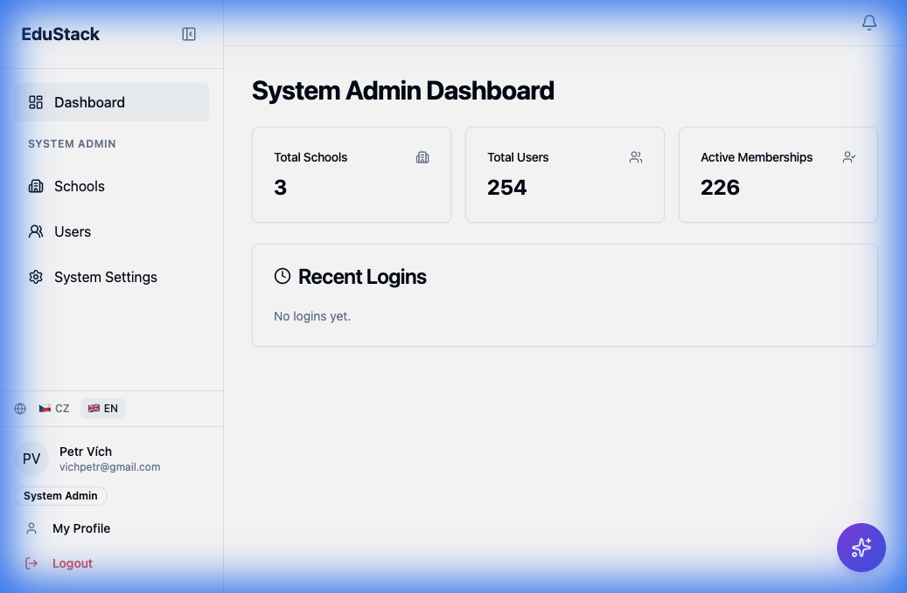
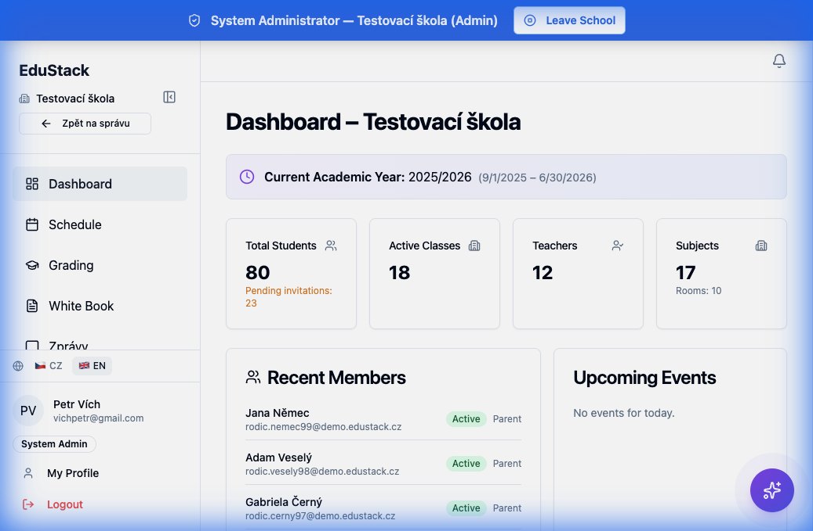
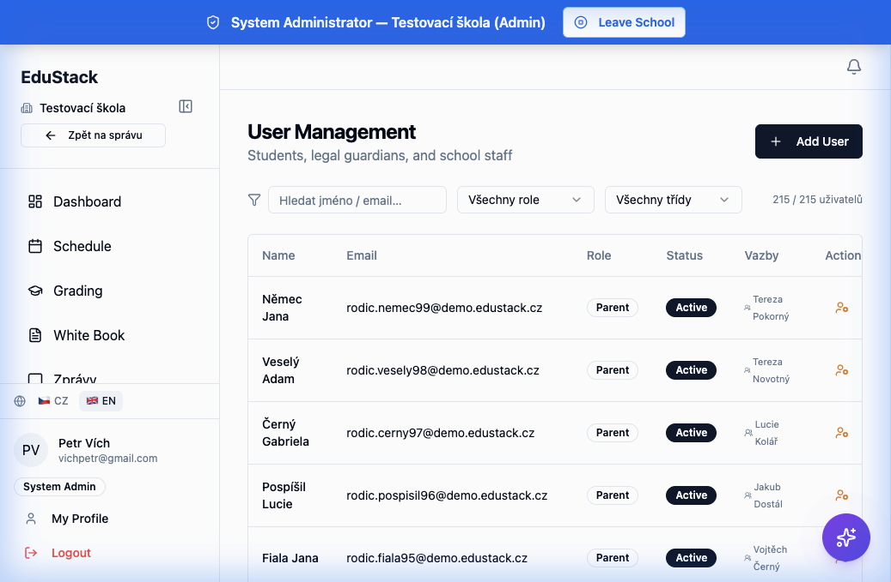
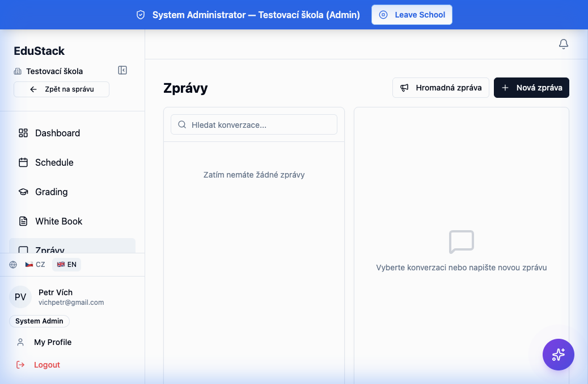

# EduStack IS – Uživatelská příručka

> Informační systém pro podporu výuky informatiky na základních a středních školách.

---

## Obsah

1. [Úvod](#1-úvod)
2. [Přihlášení do systému](#2-přihlášení-do-systému)
3. [Přehled rolí](#3-přehled-rolí)
4. [Správce systému](#4-správce-systému)
5. [Ředitel školy](#5-ředitel-školy)
6. [Zástupce ředitele](#6-zástupce-ředitele)
7. [Učitel](#7-učitel)
8. [Student](#8-student)
9. [Rodič](#9-rodič)
10. [Matice oprávnění](#10-matice-oprávnění)
11. [MCP server – programatický přístup](#11-mcp-server--programatický-přístup)
12. [Kompletní přehled funkcí systému](#12-kompletní-přehled-funkcí-systému)

---

## 1. Úvod

EduStack IS je webový informační systém určený pro základní a střední školy. Systém pokrývá klíčové agendy školní administrativy:

- **Správa uživatelů** – studenti, rodiče, učitelé, vedení školy
- **Kurikulum** – školní roky, ročníky, předměty, školní vzdělávací programy (ŠVP)
- **Rozvrh** – tvorba a správa rozvrhů, suplování
- **Klasifikace** – známkování, vysvědčení, slovní hodnocení
- **Docházka** – evidence docházky studentů
- **Komunikace** – interní zprávy, hromadné zprávy, notifikace
- **AI nástroje** – konverzační asistent, automatické vylepšení slovního hodnocení

Systém je rozdělen do tří částí:
- **Frontend** (React) – webové rozhraní pro uživatele
- **Backend** (NestJS) – API server s autentizací a autorizací
- **MCP server** – programatický přístup k datům pro AI asistenty

---

## 2. Přihlášení do systému

Po otevření aplikace se zobrazí přihlašovací stránka.

### Způsoby přihlášení

1. **E-mail a heslo** – standardní přihlášení zadáním e-mailu a hesla
2. **SSO (Single Sign-On)** – přihlášení přes Google nebo Microsoft účet (pokud je nakonfigurováno správcem systému)

### Výběr školy

Po úspěšném přihlášení je uživatel vyzván k výběru školy, ve které chce pracovat. Pokud je uživatel členem pouze jedné školy, je automaticky přesměrován na její dashboard. Pokud má uživatel v rámci jedné školy více rolí (např. učitel a rodič), vybere si pri vstupu do školy, pod jakou rolí chce pracovat.

### Aktivace účtu

Noví uživatelé obdrží pozvánku e-mailem. Po kliknutí na odkaz v pozvánce si nastaví heslo a aktivují svůj účet. Alternativně mohou při prvním přihlášení použít SSO, pokud je povoleno.

---

## 3. Přehled rolí

Systém rozlišuje následující uživatelské role:

| Role | Kód v systému | Popis |
|------|--------------|-------|
| **Správce systému** | `isSystemAdmin` | Globální správce celé instance systému |
| **Ředitel** | `PRINCIPAL` | Nejvyšší oprávnění v rámci jedné školy |
| **Zástupce** | `DEPUTY` | Zástupce ředitele – široká správní oprávnění |
| **Učitel** | `TEACHER` | Pedagogický pracovník |
| **Student** | `STUDENT` | Žák / student školy |
| **Rodič** | `PARENT` | Zákonný zástupce studenta |

> **Poznámka:** V systému existuje i role `ADMIN` (školní administrátor), která sdílí většinu oprávnění s ředitelem. Správce systému (`isSystemAdmin`) obchází veškeré kontroly rolí a má přístup ke všem funkcím.

---

## 4. Správce systému

Správce systému spravuje celou instanci EduStack IS. Operuje na globální úrovni – neváže se na konkrétní školu, ale může do jakékoli školy vstoupit.

### 4.1 Přístupné oblasti

Po přihlášení vidí správce systému v postranním menu tyto položky:

- **Dashboard** – celkový přehled systému
- **Školy** – seznam a správa všech škol
- **Uživatelé** – všichni uživatelé v systému
- **Nastavení systému** – SSO a AI konfigurace

Po vstupu do konkrétní školy se menu rozšíří o všechny školní funkce (viz role Ředitel).

### 4.2 Viditelná data

| Sekce | Data |
|-------|------|
| Dashboard | Celkový počet škol, uživatelů a aktivních členství |
| Správa škol | Název, adresa, kontakt, počet členů, třídy |
| Správa uživatelů | Všichni uživatelé se jménem, e-mailem, rolemi, statusem |
| SSO nastavení | Konfigurace Google a Microsoft OAuth providerů |
| AI nastavení | API klíče, statistiky spotřeby AI |

### 4.3 Funkce a operace

**Správa škol:**
- Vytvořit novou školu (název, adresa, kontakt, typ)
- Upravit údaje školy
- Upravit nastavení školy (self-registrace studentů, SSO apod.)
- Smazat školu (data zůstanou v databázi – soft delete)
- Přiřadit administrátora školy

**Správa uživatelů:**
- Zobrazit seznam všech uživatelů s filtrováním
- Povýšit uživatele na správce systému
- Odebrat práva správce systému

**Systémové nastavení:**
- Konfigurovat SSO poskytovatele (Google, Microsoft)
- Nastavit API klíče pro AI
- Zobrazit statistiky spotřeby AI

**Testovací data:**
- Vygenerovat kompletní testovací školu s uživateli, rozvrhem a známkami
- Smazat data konkrétní školy
- Smazat všechna data v systému

### 4.4 Data – vytváření, editace, mazání

| Operace | Co může spravovat |
|---------|-------------------|
| **Vytvořit** | Školy, systémové administrátory, testovací data |
| **Upravit** | Údaje a nastavení škol, SSO konfiguraci, AI klíče |
| **Smazat** | Školy (soft delete), systémové administrátory, testovací data |

---

## 5. Ředitel školy

Ředitel (role `PRINCIPAL`) má nejvyšší oprávnění v rámci jedné školy. Má přístup ke všem školním funkcím včetně správy uživatelů a audit logu.

### 5.1 Přístupné oblasti

**Hlavní menu:**
- **Dashboard** – přehled školy (studenti, třídy, učitelé, předměty)
- **Rozvrh** – zobrazení rozvrhů
- **Klasifikace** – přehled známek
- **Třídní kniha** – white book
- **Zprávy** – interní komunikace

**Správa školy:**
- **Učebny** – správa místností a učeben
- **Kurikulum** – školní roky, předměty, ŠVP
- **Plánovač rozvrhu** – vizuální tvorba rozvrhu
- **Suplování** – správa zastupování
- **Vysvědčení** – tvorba a správa vysvědčení
- **Nastavení roku** – konfigurace akademického roku

**Položky dostupné pouze řediteli:**
- **Správa uživatelů** – kompletní přehled a správa všech uživatelů školy
- **Audit log** – záznam všech citlivých operací

### 5.2 Viditelná data

| Sekce | Data |
|-------|------|
| Dashboard | Počet studentů (vč. pozvánky čekající na přijetí), tříd, učitelů, předmětů, místností; nedávní členové; nadcházející události |
| Rozvrh | Rozvrhy všech tříd, učitelů a studentů; nastavení časových slotů |
| Klasifikace | Známky všech studentů ve všech třídách; průměry; přehled typů hodnocení |
| Správa uživatelů | Jméno, e-mail, role, status, vazby rodič–student pro všechny uživatele školy |
| Kurikulum | Školní roky, semestry, ročníky, šablony předmětů, instance předmětů, učitelské úvazky, verze ŠVP |
| Audit log | Chronologický záznam citlivých operací (přístupy k datům, změny) |

### 5.3 Funkce a operace

**Správa tříd, místností a předmětů:**
- Vytvořit, upravit a smazat třídy
- Vytvořit, upravit a smazat místnosti (s kapacitou a vybavením)
- Vytvořit, upravit a smazat šablony předmětů

**Správa uživatelů:**
- Pozvat nového uživatele (student, rodič, učitel, administrátor)
- Vytvořit studenta společně s rodičem (rodinná registrace)
- Vytvořit zaměstnance školy
- Odebrat uživatele ze školy
- Označit studenta jako absolventa
- Impersonovat (přihlásit se jako) jiný uživatel
- Opakovaně odeslat pozvánku

**Kurikulum:**
- Vytvořit školní rok a semestry
- Vytvořit a spravovat ročníky
- Přiřadit předměty k ročníkům (instance předmětů)
- Spravovat učitelské úvazky
- Vytvořit, duplikovat a porovnávat verze ŠVP
- Importovat RVP (rámcový vzdělávací program)
- Hromadně zapsat studenty do ročníků

**Rozvrh:**
- Definovat časové sloty (začátek a konec hodin)
- Vytvářet, upravovat a mazat rozvrhové události (i hromadně)
- Validovat kolize v rozvrhu
- Vytvářet, upravovat a mazat suplování

**Klasifikace:**
- Vytvářet, upravovat a mazat známky
- Vytvářet a upravovat vysvědčení
- Použít AI pro vylepšení slovního hodnocení

**Zprávy:**
- Posílat přímé zprávy
- Odeslat hromadnou zprávu třídě
- Odeslat hromadnou zprávu celé škole
- Spravovat notifikace

**Audit log:**
- Zobrazit stránkovaný záznam všech citlivých operací ve škole

### 5.4 Data – vytváření, editace, mazání

| Operace | Co může spravovat |
|---------|-------------------|
| **Vytvořit** | Třídy, místnosti, předměty, uživatele, šk. roky, semestry, ročníky, instance předmětů, úvazky, verze ŠVP, známky, rozvrhové události, suplování, vysvědčení, zprávy |
| **Upravit** | Třídy, místnosti, předměty, ročníky, verze ŠVP, známky, rozvrh. události, suplování, vysvědčení, časové sloty |
| **Smazat** | Třídy, místnosti, předměty, ročníky, uživatele (ze školy), verze ŠVP, známky, rozvrh. události, suplování |

---

## 6. Zástupce ředitele

Zástupce ředitele (role `DEPUTY`) sdílí většinu oprávnění s ředitelem. Hlavní rozdíly jsou v přístupu k audit logu a zobrazení správy uživatelů v navigaci.

### 6.1 Přístupné oblasti

Stejné jako ředitel, **s výjimkou**:
- ❌ **Správa uživatelů** – odkaz se nezobrazuje v navigačním menu (ale API endpointy pro správu uživatelů jsou přístupné)
- ❌ **Audit log** – nemá přístup

### 6.2 Viditelná data

Stejná jako ředitel, **kromě**:
- ❌ Audit log

### 6.3 Funkce a operace

Totožné s ředitelem, **s výjimkou**:
- ❌ Zobrazení audit logu
- ✅ Hromadná zpráva celé škole – dostupná
- ✅ Správa uživatelů přes API – dostupná (pouze chybí odkaz v navigaci)

### 6.4 Data – vytváření, editace, mazání

Stejné jako ředitel (vyjma audit logu).

---

## 7. Učitel

Učitel (role `TEACHER`) má přístup k výukovým funkcím – rozvrhu, klasifikaci, docházce a komunikaci.

### 7.1 Přístupné oblasti

- **Dashboard** – základní přehled
- **Rozvrh** – zobrazení rozvrhů
- **Klasifikace** – správa známek
- **Třídní kniha** – white book
- **Zprávy** – komunikace s kolegy, studenty a rodiči

> **Učitel nemá přístup** k žádné sekci „Správa školy" – nevidí učebny, kurikulum, plánovač rozvrhu, suplování, nastavení roku, správu uživatelů ani audit log.

### 7.2 Viditelná data

| Sekce | Data |
|-------|------|
| Rozvrh | Vlastní rozvrh učitele (napříč školami); rozvrhy tříd a studentů |
| Třídy | Seznam tříd a studentů, které učitel vyučuje |
| Klasifikace | Známky studentů ve svých třídách, průměry, typy hodnocení |
| Zprávy | Vlastní konverzace, seznam dostupných příjemců |

### 7.3 Funkce a operace

**Klasifikace:**
- Zadat známku studentovi (hodnota, váha, popis)
- Upravit nebo smazat vlastní známky
- Zobrazit známky celé třídy nebo konkrétního studenta
- Zobrazit průměr studenta z předmětu
- Vytvořit/upravit vysvědčení
- Použít AI pro vylepšení slovního hodnocení

**Docházka:**
- Zaznamenat docházku studenta (přítomen, nepřítomen, pozdní příchod, omluven)

**Zprávy:**
- Posílat přímé zprávy
- Odeslat hromadnou zprávu třídě
- Spravovat notifikace

**AI:**
- Používat AI chatovacího asistenta

### 7.4 Data – vytváření, editace, mazání

| Operace | Co může spravovat |
|---------|-------------------|
| **Vytvořit** | Známky, záznamy docházky, zprávy, hromadné zprávy třídě |
| **Upravit** | Známky |
| **Smazat** | Známky |
| **Pouze čtení** | Vlastní rozvrh, seznamy tříd a studentů, konverzace |

---

## 8. Student

Student (role `STUDENT`) má přístup pouze k vlastním datům – rozvrhu, známkám a zprávám.

### 8.1 Přístupné oblasti

- **Dashboard** – základní přehled
- **Rozvrh** – zobrazení vlastního rozvrhu
- **Klasifikace** – zobrazení vlastních známek
- **Třídní kniha** – white book
- **Zprávy** – komunikace

### 8.2 Viditelná data

| Sekce | Data |
|-------|------|
| Profil | Vlastní osobní údaje (jméno, třída, kontaktní údaje) |
| Rozvrh | Vlastní rozvrh |
| Klasifikace | Vlastní známky a průměry z jednotlivých předmětů |
| Zprávy | Vlastní konverzace |

### 8.3 Funkce a operace

- Zobrazit vlastní profil
- Zobrazit vlastní rozvrh
- Zobrazit vlastní známky a průměry
- Posílat a přijímat zprávy
- Spravovat notifikace (označit jako přečtené)
- Používat AI chatovacího asistenta

> **Student nemůže:** vytvářet ani mazat známky, upravovat rozvrh, spravovat uživatele, posílat hromadné zprávy třídě ani škole.

### 8.4 Data – vytváření, editace, mazání

| Operace | Co může spravovat |
|---------|-------------------|
| **Vytvořit** | Zprávy v konverzacích |
| **Upravit** | Stav notifikací (přečteno/nepřečteno) |
| **Pouze čtení** | Vlastní profil, rozvrh, známky, průměry |

---

## 9. Rodič

Rodič (role `PARENT`) má přístup k datům svých propojených dětí – jejich rozvrhu, známkám a profilu.

### 9.1 Přístupné oblasti

- **Dashboard** – základní přehled
- **Rozvrh** – zobrazení rozvrhu
- **Klasifikace** – zobrazení klasifikace
- **Třídní kniha** – white book
- **Zprávy** – komunikace s učiteli a vedením školy

### 9.2 Viditelná data

| Sekce | Data |
|-------|------|
| Děti | Seznam všech propojených dětí (i napříč školami) |
| Dashboard dítěte | Známky, rozvrh a profil konkrétního dítěte |
| Zprávy | Vlastní konverzace |

> **Důležité:** Rodič vidí data **pouze svých propojených dětí**. Systém ověřuje vazbu rodič–student při každém přístupu.

### 9.3 Funkce a operace

- Zobrazit seznam svých dětí
- Zobrazit dashboard dítěte (profil, rozvrh, známky)
- Posílat a přijímat zprávy
- Spravovat notifikace
- Používat AI chatovacího asistenta

> **Rodič nemůže:** vytvářet ani mazat známky, upravovat rozvrh, spravovat uživatele, posílat hromadné zprávy.

### 9.4 Data – vytváření, editace, mazání

| Operace | Co může spravovat |
|---------|-------------------|
| **Vytvořit** | Zprávy v konverzacích |
| **Upravit** | Stav notifikací (přečteno/nepřečteno) |
| **Pouze čtení** | Data svých dětí (profil, rozvrh, známky) |

---

## 10. Matice oprávnění

Přehledná tabulka zobrazující přístup jednotlivých rolí ke klíčovým funkcím systému:

| Funkcionalita | Správce systému | Ředitel | Zástupce | Učitel | Student | Rodič |
|---|:---:|:---:|:---:|:---:|:---:|:---:|
| **Systémová správa** | | | | | | |
| Správa škol (CRUD) | ✅ | ❌ | ❌ | ❌ | ❌ | ❌ |
| SSO / AI konfigurace | ✅ | ❌ | ❌ | ❌ | ❌ | ❌ |
| Správa sys. adminů | ✅ | ❌ | ❌ | ❌ | ❌ | ❌ |
| **Správa školy** | | | | | | |
| Dashboard školy | ✅ | ✅ | ✅ | – | – | – |
| Správa uživatelů | ✅ | ✅ | ⚠️* | ❌ | ❌ | ❌ |
| Audit log | ✅ | ✅ | ❌ | ❌ | ❌ | ❌ |
| Správa tříd | ✅ | ✅ | ✅ | ❌ | ❌ | ❌ |
| Správa místností | ✅ | ✅ | ✅ | ❌ | ❌ | ❌ |
| Správa předmětů | ✅ | ✅ | ✅ | ❌ | ❌ | ❌ |
| **Kurikulum** | | | | | | |
| Školní roky a semestry | ✅ | ✅ | ✅ | ❌ | ❌ | ❌ |
| Ročníky a zápisy | ✅ | ✅ | ✅ | ❌ | ❌ | ❌ |
| Instance předmětů | ✅ | ✅ | ✅ | ❌ | ❌ | ❌ |
| Verze ŠVP | ✅ | ✅ | ✅ | ❌ | ❌ | ❌ |
| Import RVP | ✅ | ✅ | ✅ | ❌ | ❌ | ❌ |
| **Rozvrh** | | | | | | |
| Zobrazit rozvrh | ✅ | ✅ | ✅ | ✅ | ✅ | ✅ |
| Vytvořit/editovat události | ✅ | ✅ | ✅ | ❌ | ❌ | ❌ |
| Suplování | ✅ | ✅ | ✅ | ❌ | ❌ | ❌ |
| **Klasifikace** | | | | | | |
| Zobrazit známky | ✅ | ✅ | ✅ | ✅ | ✅† | ✅‡ |
| CRUD známek | ✅ | ✅ | ✅ | ✅ | ❌ | ❌ |
| Vysvědčení | ✅ | ✅ | ✅ | ✅ | ❌ | ❌ |
| AI polish hodnocení | ✅ | ✅ | ✅ | ✅ | ❌ | ❌ |
| **Komunikace** | | | | | | |
| Přímé zprávy | ✅ | ✅ | ✅ | ✅ | ✅ | ✅ |
| Hromadná zpráva třídě | ✅ | ✅ | ✅ | ✅ | ❌ | ❌ |
| Hromadná zpráva škole | ✅ | ✅ | ✅ | ❌ | ❌ | ❌ |
| **AI** | | | | | | |
| AI chat | ✅ | ✅ | ✅ | ✅ | ✅ | ✅ |

\* Zástupce má API přístup ke správě uživatelů, ale odkaz se nezobrazuje v menu  
† Student vidí pouze vlastní známky  
‡ Rodič vidí pouze známky svých dětí

---

## 11. MCP server – programatický přístup

MCP (Model Context Protocol) server umožňuje AI asistentům a externím nástrojům programaticky pracovat s daty systému. Server poskytuje **36 nástrojů** ve 6 kategoriích.

> **Poznámka:** MCP server operuje přímo s databází bez role-based autorizace. Přístup k MCP serveru by měl být omezen na důvěryhodné klienty (AI agenty).

### 11.1 Analytika (2 nástroje)

| Nástroj | Popis |
|---------|-------|
| `get_attendance_summary` | Sumář docházky studenta v daném období |
| `get_academic_performance` | Studijní průměry žáka podle předmětů pro školní rok |

### 11.2 Kurikulum (8 nástrojů)

| Nástroj | Popis |
|---------|-------|
| `create_academic_year` | Vytvoření školního roku |
| `list_academic_years` | Výpis školních roků |
| `list_grade_levels` | Výpis ročníků školy |
| `list_subject_templates` | Výpis šablon předmětů |
| `create_subject_template` | Vytvoření šablony předmětu |
| `create_subject_instance` | Přiřazení předmětu k ročníku a roku |
| `list_subject_instances` | Výpis instancí předmětů |
| `enroll_students` | Hromadný zápis studentů do ročníku |

### 11.3 Klasifikace a docházka (3 nástroje)

| Nástroj | Popis |
|---------|-------|
| `create_grade` | Zadání známky studentovi |
| `list_student_grades` | Výpis známek studenta |
| `record_attendance` | Záznam docházky (přítomen, nepřítomen, pozdní, omluven) |

### 11.4 Správa (4 nástroje)

| Nástroj | Popis |
|---------|-------|
| `create_school` | Vytvoření nové školy |
| `create_student_and_parent` | Vytvoření studenta a rodiče v jedné transakci |
| `create_room` | Vytvoření učebny/místnosti |
| `list_rooms` | Výpis učeben školy |

### 11.5 Seeding – generování dat (4 nástroje)

| Nástroj | Popis |
|---------|-------|
| `seed_school_structure` | Naplnění školy strukturou (třídy, předměty, šk. rok) dle typu školy |
| `seed_teachers` | Vygenerování učitelů s profily a úvazky |
| `seed_students` | Vygenerování studentů s rodiči a zařazením do tříd |
| `seed_grades_and_schedule` | Vygenerování známek a rozvrhových událostí |

### 11.6 Uživatelé a školy (15 nástrojů)

| Nástroj | Popis |
|---------|-------|
| `list_users` | Výpis uživatelů (filtr dle školy, role, statusu, jména) |
| `get_user_detail` | Detail uživatele vč. členství, profilů, rodinných vazeb |
| `create_user` | Vytvoření uživatele s volitelným přiřazením ke škole |
| `update_user` | Aktualizace údajů uživatele |
| `assign_user_role` | Přiřazení nebo změna role ve škole |
| `remove_user_from_school` | Odebrání uživatele ze školy |
| `list_schools` | Výpis všech škol |
| `get_school_detail` | Detail školy vč. tříd, šk. roků, členů dle rolí |
| `update_school` | Aktualizace údajů školy |
| `list_classrooms` | Výpis tříd v škole |
| `create_classroom` | Vytvoření třídy |
| `assign_student_to_classroom` | Přiřazení studenta do třídy |
| `link_parent_to_student` | Propojení rodiče se studentem |
| `delete_school` | Smazání školy (soft delete) |
| `batch_create_users` | Hromadné vytvoření uživatelů s přiřazením a vazbami |

---

## 12. Kompletní přehled funkcí systému

### 12.1 Autentizace a autorizace
- Přihlášení e-mailem a heslem
- SSO přihlášení (Google, Microsoft)
- Výběr školy a role po přihlášení
- JWT tokeny (globální a školní)
- Role-based přístupová kontrola
- Impersonace uživatele (správa)
- Aktivace účtu přes pozvánku
- Nahrání avataru a úprava profilu

### 12.2 Správa systému
- Dashboard systému (počet škol, uživatelů, členství)
- CRUD škol (vytvoření, úprava, soft delete)
- Správa systémových administrátorů
- Konfigurace SSO providerů (Google, Microsoft)
- Konfigurace AI (API klíče pro OpenAI, Anthropic apod.)
- Přehled spotřeby AI
- Generování a reset testovacích dat

### 12.3 Správa školy
- Dashboard školy se statistikami
- CRUD tříd (název, ročník)
- CRUD místností (kapacita, vybavení, PC učebna)
- CRUD šablon předmětů (název, kód, popis ze ŠVP)
- Pozvání a správa uživatelů (studenti, rodiče, učitelé, vedení)
- Rodinná registrace (student + rodič současně)
- Import uživatelů z CSV
- Nastavení absolventa (alumni status)
- Audit log citlivých operací

### 12.4 Kurikulum
- Správa školních roků a semestrů
- Správa ročníků (grade levels)
- Správa instancí předmětů (přiřazení k ročníku a roku s hodinovou dotací)
- Správa učitelských úvazků
- Verzování ŠVP – vytvoření, duplikace, porovnání verzí
- Import RVP (rámcový vzdělávací program)
- Hromadný zápis studentů do ročníků

### 12.5 Rozvrh
- Definice časových slotů (začátek a konec hodin)
- CRUD rozvrhových událostí (jednotlivě i hromadně)
- Validace kolizí v rozvrhu
- Zobrazení rozvrhu třídy, učitele a studenta
- CRUD suplování
- Vizuální plánovač rozvrhu

### 12.6 Klasifikace
- CRUD známek (hodnota, váha, popis, datum)
- Zobrazení známek dle třídy a studenta
- Výpočet vážených průměrů
- Vysvědčení (report cards) – vytvoření a úprava
- AI vylepšení slovního hodnocení
- Přehled typů hodnocení dle třídy

### 12.7 Docházka
- Záznam docházky (přítomen, nepřítomen, pozdní příchod, omluven)
- Sumář docházky za období

### 12.8 Komunikace
- Přímé konverzace mezi uživateli
- Hromadná zpráva třídě
- Hromadná zpráva celé škole
- Notifikace s počítadlem nepřečtených
- Označení notifikací jako přečtených (jednotlivě i hromadně)
- Zapnutí/vypnutí e-mailových notifikací
- Vyhledávání příjemců

### 12.9 AI funkce
- Konverzační AI chat (streaming)
- AI polish (vylepšení) slovního hodnocení
- Seedování dat pomocí AI
- Výběr AI poskytovatele

### 12.10 Třídní kniha
- Zobrazení dat třídní knihy (White Book)

### 12.11 MCP server
- 36 programatických nástrojů pro AI asistenty
- Analytika (docházka, prospěch)
- Kurikulum (šk. roky, ročníky, předměty, zápisy)
- Klasifikace (známky, docházka)
- Správa (školy, místnosti, uživatelé)
- Seeding (generování kompletních testovacích dat)
- Hromadné operace (batch vytváření uživatelů)
